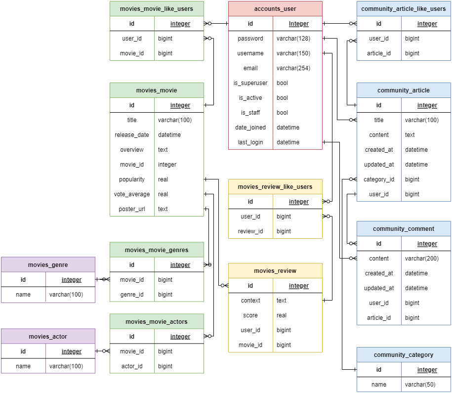
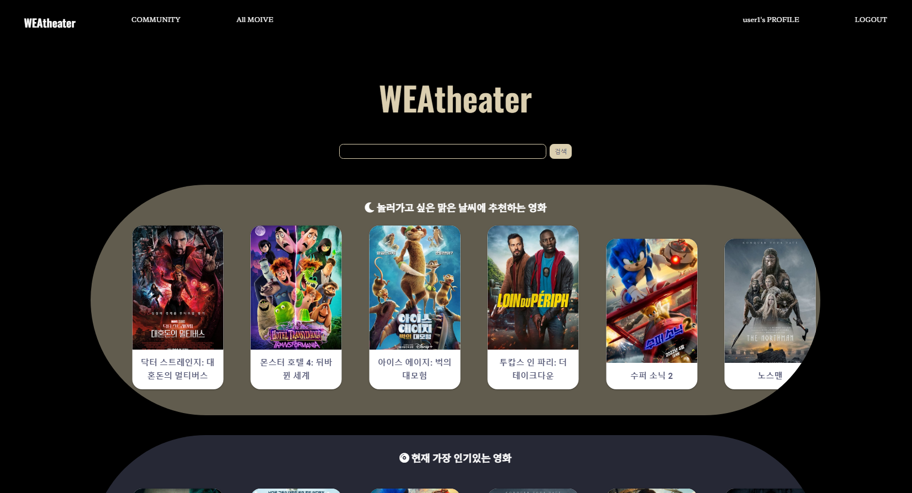
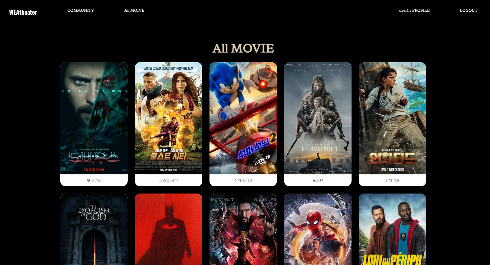
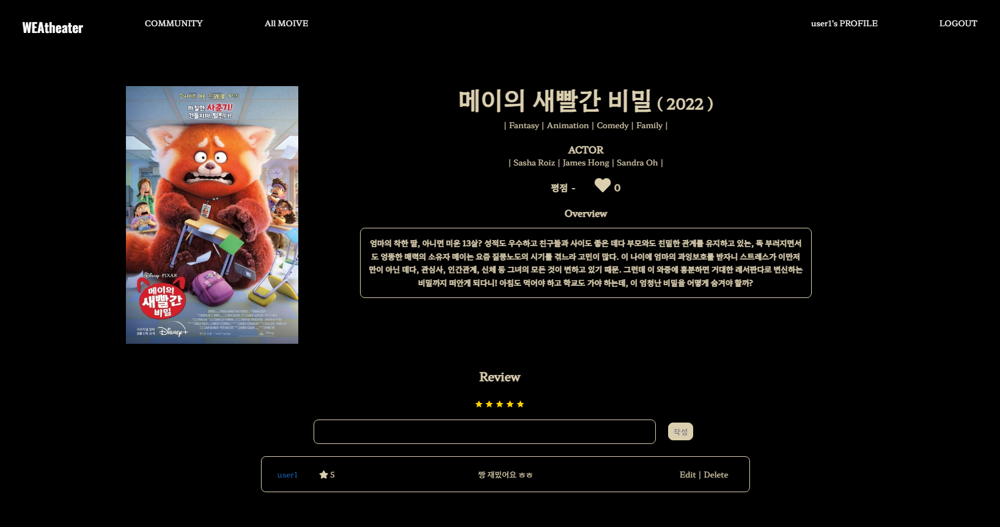
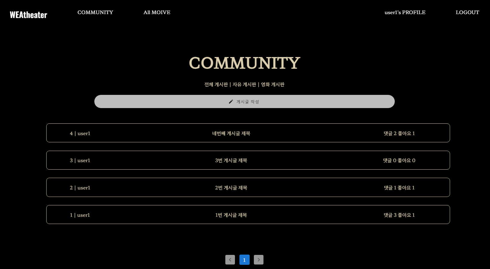
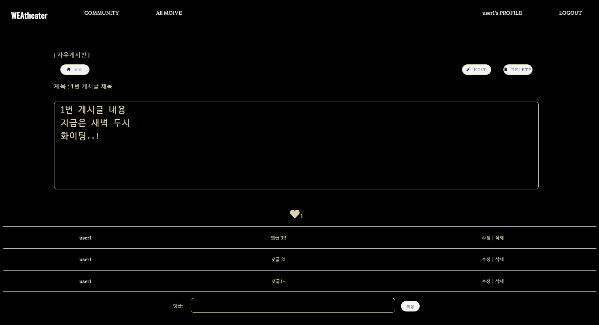
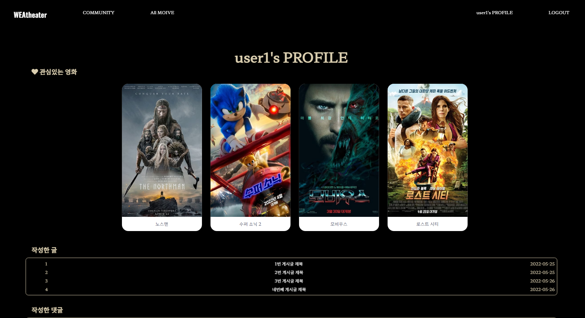
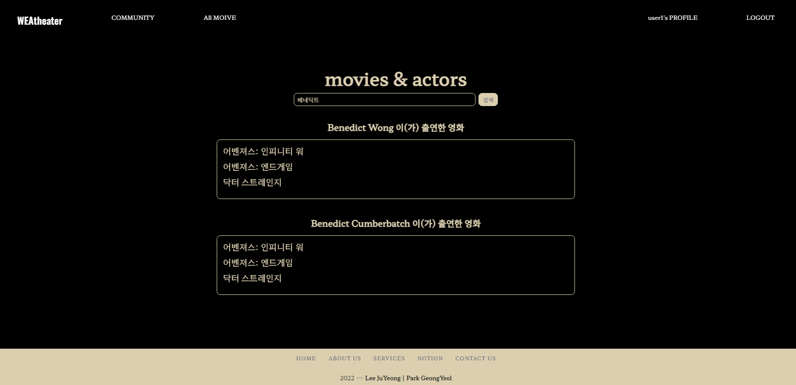

# SSAFY 1학기 Final Project


> #### 영화 추천 및 커뮤니티 사이트 제작

#####  프로젝트 기간 : 22.05.20 - 22.05.26 (7일)

##### 프로젝트 구성원 : 이주영 박경열

##### 프로젝트 관련 : [NOTION](https://www.notion.so/Final-Project-95852633acd14f1badcd48db12ad8e54) 


## 🐕개요

---

#### 1. 개발 환경
#### 2. 프로젝트 설명
#### 3. 알고리즘 설명

#### 4. Front 설명

#### 5. 마무리


## 🛠 개발 환경

---


**A. 언어**

​	**i. Python 3.9**

​	**ii. Django 3.2.8**

​	**iii. Vue.js 2**

**B. 개발 도구 및 라이브러리**

​	**i. VSCode**

​	**ii. Chrome Browser**

​	**iii. Swagger**

**C. 아키텍처**

​	**i. Django REST API 서버 & Vue JS (with Vuex)**

**D. API**

​	**i. The Movie Database(TMDB)**

​	**ii. openweathermap**

​	**iii. geoplugin**


# WEAtheater

> #### 유저의 위치를 활용한 날씨 기반 영화 추천 (Weather + theater)


## 🚐 Project Concept

---

#### 1. 음악애플리케이션처럼 날씨를 활용해 영화를 추천하기

- 위치API로 날씨 정보 얻기
- 날씨에 따라 장르를 분류한 후 날씨별로 해당 장르의 영화 추천

#### 2. 유저가 관심있는 영화 데이터를 사용해 영화를 추천하기

- 가입할 때 선호하는 영화를 선택
- 가입 후 웹페이지를 보며 영화 좋아요 누르기 가능
- 관심있는 영화의 장르와 출연 배우를 활용해 영화 추천


## 👫 역할 분담

---

#### 팀장 : 이주영 | 팀원 : 박경열

##### 이주영 : ERD | DB | BE | FE | Model Object -> Dictionary 변환 | JSON 변환 | 날씨 활용 영화 추천 알고리즘 | 장르 활용 영화 추천 알고리즘 | account 관련 알고리즘 | community 관련 알고리즘

##### 박경열 : ERD | DB | BE | FE | 로딩 속도 최적화 | 위치 API 활용 | 배우 활용 영화 추천 알고리즘 | 검색 알고리즘 | movie 관련 알고리즘


## 📃 ERD

---




## 🎢 알고리즘

---

### 1.  장르 활용 영화 추천 알고리즘

- `user`가 좋아요를 누른 영화들을 역참조하여 활용
- 관심 영화들의 `movie id`를 모아 그 영화들의 장르 데이터를 얻어 그 장르인 영화들 중 6개만 가져와 사용하였다.
- 그 영화들을 모두 모아 `list`로 `return`


#### 결과 알고리즘

```python
def genre_recommend(request):
    user = request.user
    like_movies = user.like_movies.all()
    movie_list = []
    # 같은 장르 출력할 때 좋아요 누른 영화는 제외하고 추천하기 위해
    # 좋아요 누른 영화 id를 저장해놓았다가 id가 다른 영화만 list에 저장해서 출력
    ids = []
    for movie in like_movies:
        ids.append(movie.id)

    for movie in like_movies:
        for movie_genre in movie.genres.all():                
            genre = get_object_or_404(Genre, pk=movie_genre.id)
            genre_movies = genre.movies.all()[:6]
            for genre_movie in genre_movies:
                if genre_movie.id not in ids:
                    movie_list.append(convert(genre_movie))
    return movie_list
```


### 2. 배우 활용 영화 추천 알고리즘

- DB에 영화 정보를 받아올 때 `TMDB`에서 `GET POPULAR`을 사용하였는데 이 정보에는 영화의 출연 배우 정보가 없었다.

- 그래서 선호하는 영화를 `TMDB`의 `GET CREDITS`에 요청을 보내 배우 정보를 가져와 그 배우의 출연 작품 정보를 얻기 위해 `TMDB`에 요청을 보냈고, 그 영화들의 `movie id`를 활용하여 `TMDB`의 `GET DETAIL`에 요청을 보내 영화 정보를 가져와 추천해주었다.

- 이 알고리즘은 매번 3번 API요청을 보내기 때문에 효율성이 매우 떨어져 시간이 매우 많이 소요되었다. (대략 10초)

- 시간을 줄이기 위해 고민하다 DB에 영화정보를 받아올 때 field를 추가해 배우 정보를 같이 받아오고, 그 배우들을 모아 `Actor table`을 만드는 방법을 찾아내었고 이 방법을 사용하니 추천 알고리즘에서 API를 사용하지 않아도 되어 시간이 많이 단축되었다.

```python
# 원래 알고리즘 코드
def actor_recommend(request):
    API_KEY = '..api_key..'
    flag = False
    user = request.user
    actor_list = []
    movies = user.like_movies.all()
    for movie in movies:
        if flag:
            break
        movie_id = movie.movie_id
        movie_details = requests.get(f'https://api.themoviedb.org/3/movie/{movie_id}/credits?api_key={API_KEY}&language=ko-KR').json()
        for movie_detail in movie_details['cast']:
            cnt = 0
            if cnt <= 5:
                if movie_detail['known_for_department'] == 'Acting' and movie_detail['popularity'] >= 10:
                    actor_list.append(movie_detail['id'])
                    cnt += 1
            else:
                flag = True
                break
    flag = False
    actor_movie_id = []
    for movie in movie_list:
        for actor_pk in movie.actors:
            if flag:
                break
            actor_movies = requests.get(f'https://api.themoviedb.org/3/person/{actor_pk}/movie_credits?api_key={API_KEY}&language=ko-KR').json()
            for movie in actor_movies['cast']:
                cnt = 0
                if cnt <= 5:
                    if movie['popularity'] >= 10:
                        actor_movie_id.append(movie['id'])
                        cnt += 1
                else:
                    flag = True
                    break
        if flag:
          break
    
    cnt = 0
    actor_movie_list = []
    for movie_id in actor_movie_id:
        actor_movie = requests.get(f'https://api.themoviedb.org/3/movie/{movie_id}?api_key={API_KEY}&language=ko-KR').json()
        genres = []
        for genre in actor_movie['genres']:
            genres.append(genre['id'])
        movie_set = {
            'title': actor_movie['title'],
            'release_date': actor_movie['release_date'],
            'genres': genres,
            'overview': actor_movie['overview'],
            'movie_id': actor_movie['id'],
            'popularity': actor_movie['popularity'],
            'vote_average': actor_movie['vote_average'],
            'poster_url': actor_movie['poster_path']
        }
        actor_movie_list.append(movie_set)
        cnt += 1
        if cnt == 10:
            break
    return actor_movie_list
```


#### 결과 알고리즘

```python
def actor_recommend(request):
    user = request.user
    rec_movies = []
    movie_list = user.like_movies.all()
    for movie in movie_list:
        now_movie = get_object_or_404(Movie, pk=movie.pk)
        actor_list = now_movie.actors.all()
        for actor in actor_list:
            ms = actor.movies.all()
            for m in ms:
                if m not in rec_movies:
                    rec_movies.append(convert(m))
    return rec_movies
```


### 3. 날씨 활용 영화 추천 알고리즘

- 위치 데이터를 얻기 위해 `geoplugin`에 요청을 보냈다.

- 위치 데이터를 받아올 수 없으면 `movie table`에서 10개를 가져오도록 하였다.

- 위치 데이터를 받아왔다면 `openweathermap API` 를 활용하여 날씨 데이터를 얻었다. 

- 날씨별 장르들을 정하였다.

    | 날씨 코드 | 날씨         | 장르, 장르 id                                                |
    | --------- | ------------ | ------------------------------------------------------------ |
    | Group 2xx | Thunderstorm | (범죄, 80), (공포, 27), (스릴러, 53), (미스터리, 9648)       |
    | Group 3xx | Drizzle      | (애니메이션, 16), (음악, 10402), (로맨스, 10749)             |
    | Group 5xx | Rain         | (공포, 27), (미스터리, 9648), (스릴러, 53), (모험, 12)       |
    | Group 6xx | Snow         | (드라마, 18), (로맨스, 10749), (TV 영화, 10770), (가족, 10751) |
    | Group 7xx | Atmosphere   | (미스터리, 9648), (전쟁, 10752), (SF, 878), (서부, 37)       |
    | Group 800 | Clear        | (액션, 28), (모험, 12), (애니메이션, 16), (코미디, 35), (가족, 10751), (판타지, 14) |
    | Group 8xx | Clouds       | (역사, 36), (다큐멘터리, 99), (음악, 10402)                  |

- 날씨 데이터를 이용해 날씨별 장르 `dictionary`를 활용하여 그 장르인 영화를 5개씩 가져와 `list`로 `return`하였다.

- 날씨에 맞게 아이콘을 보여주기 위해 날씨 데이터도 활용하였다.


#### 결과 알고리즘

```python
# 날씨 활용 추천 알고리즘
def weather_recommend():
    here_req = requests.get("http://www.geoplugin.net/json.gp")

    movies = []
    if (here_req.status_code != 200):
        movies = Movie.objects.all()[:10]
    else:
        location = json.loads(here_req.text)
        crd = {"lat": str(location["geoplugin_latitude"]), "lng": str(location["geoplugin_longitude"])}
        apiKey = '..api_key..'
        weather_req = requests.get(f"https://api.openweathermap.org/data/2.5/weather?lat={crd['lat']}&lon={crd['lng']}&appid={apiKey}").json()
        # 날씨별 장르 id list
        weather_genre = {
            'Thunderstrom': [80, 27, 53, 9648],
            'Drizzle': [16, 10402, 36],
            'Rain': [27, 9648, 53, 12],
            'Snow': [18, 10749, 10770, 10751],
            'Atmosphere': [9645, 10752, 818, 37],
            'Clear': [28, 12, 16, 35, 10751, 14],
            'Clouds': [36, 99, 10402]
        }
        weather_genre_list = weather_genre[weather_req['weather'][0]['main']]
        # 장르 id로 genre object를 찾은 뒤 그 genre를 역참조하는 movies를 genre_movies에 할당
        # 그 영화들을 movies list에 추가한 뒤 리턴
        for genre_pk in weather_genre_list:
            genre = get_object_or_404(Genre, pk=genre_pk)
            genre_movies = genre.movies.all()[:5]   # 장르별 영화 받아오기
            for genre_movie in genre_movies:
                movies.append(convert(genre_movie))
    return movies
```

```python
# 날씨 아이콘 사용
@api_view(['GET'])
def weather_icon(request):
    here_req = requests.get("http://www.geoplugin.net/json.gp")

    weather_req = []
    if (here_req.status_code != 200):
        pass
    else:
        location = json.loads(here_req.text)
        crd = {"lat": str(location["geoplugin_latitude"]), "lng": str(location["geoplugin_longitude"])}
        apiKey = '..api_key..'
        weather_req = requests.get(f"https://api.openweathermap.org/data/2.5/weather?lat={crd['lat']}&lon={crd['lng']}&appid={apiKey}").json()
    
    return Response(weather_req['weather'])
```


### Model Object를 Dictionary로 변환하는 알고리즘

- 프로젝트를 진행하면서 가장 많이 만난 에러

```bash
TypeError: Object of type Actor is not JSON serializable
TypeError: Object of type Genre is not JSON serializable
TypeError: Object of type User is not JSON serializable
TypeError: Object of type Movie is not JSON serializable
```

- 모든 Model에서 다 나온 것 같다..
- 배울 때는 한번에 한 `model`에 대해 `serializer`를 만들어 그 `data`를 `Response` 하였는데 여러 정보를 한번에 `Response`하려니 `serilaizer`를 사용할 수가 없었다. 그래서 `list`로 만들어 직접 `JSON` 형태로 `Response`하였는데 그 때 에러를 가장 많이 경험했다.


#### 결과 알고리즘

```python
# obj -> dict
def convert(ob):
    # user object -> dict
    now_movie = model_to_dict(ob)
    tmp = []
    for like_user in now_movie['like_users']:
        now_user = model_to_dict(like_user)
        tmp.append(now_user)
    now_movie['like_users'] = tmp

    # 배우 object -> dict
    tmp = []
    for actor in now_movie['actors']:
        now_actor = model_to_dict(actor)
        tmp.append(now_actor)
    now_movie['actors'] = tmp

    # 장르 object -> model
    temp = []
    for genr in now_movie['genres']:
        now_genre = model_to_dict(genr)
        temp.append(now_genre)
    now_movie['genres'] = temp
    return now_movie
```


### Movie List들을 Response

#### 1. List들을 한번에 JSON 형태로 Response

```python
# 원래 코드
@api_view(['GET'])
def movie_list(request):
    top10_list = Movie.objects.order_by('pk')[:10]
    top10 = []
    for top10_movie in top10_list:
        top10.append(convert(top10_movie))

    genre = set_data(genre_recommend(request))  
    weather = set_data(weather_recommend())
    actor = set_data(actor_recommend(request))

    serializer = [
        {
        'top10': top10
        },
        {
        'actor': actor
        },
        {
        'weather': weather
        },
        {
        'genre': genre
        }
    ]
    return Response(serializer)
```

- 이렇게 어렵게 코드를 작성했지만 `Home`화면에 보여줄 영화 `list`를 한번에 로딩하니까 페이지 로딩시간이 오래 걸려 코드를 수정하였다.
- 각 영화 `list`를 따로 보내 비동기식으로 작동하게 만들어 로딩시간을 단축시켰다.


#### 2. List들을 각각 Response

```python
# 탑텐
@api_view(['GET'])
def movie_list(request):
    top10_list = Movie.objects.order_by('pk')[:10]
    top10 = []
    for top10_movie in top10_list:
        top10.append(convert(top10_movie))
    return Response(top10)

# 장르
@api_view(['GET'])
def genre_list(request):
    genre = set_data(genre_recommend(request))
    return Response(genre)

# 날씨
@api_view(['GET'])
def weather_list(request):
    weather = set_data(weather_recommend())
    return Response(weather)

# 배우
@api_view(['GET'])
def actor_list(request):
    actor = set_data(actor_recommend(request))
    return Response(actor)
```


### 검색 알고리즘

- `TMDB`의 `SEARCH`에 요청을 보내 데이터를 활용한다.
- `SearchBar` 컴포넌트 없이 바로 `HomeView`에 바로 `input tag` 를 넣어 하려 했으나 실패
- `HomeView`에서 받은 `input`을 `SearchBar`에서 `keyup.enter event`가 일어날 때 `action` 실행
- 여기서도 `input`이 `getSearchMovies`에 제대로 들어가지 않아 오래걸림..
- 실행 시에 결과값을 `searchData`에 저장하고 `SearchView`로 이동
- `v-for`를 통해 하위 컴포넌트인 `MovieItem`에서 값을 가공하여 출력

- 매우 간단한 코드인데 처음에 `query`값을 `input`이 아닌 `request.data`로 받아서 해맸다.

```python
@api_view(['GET'])
def search(request, input):

    API_KEY = 'api_key'
    
    search_result = requests.get(f'https://api.themoviedb.org/3/search/multi?api_key={API_KEY}&language=ko-KR&page=1&include_adult=false&query={input}').json()

    return Response(search_result)
```


## 🎨 Front

---

### Vue

#### 1. Signup 후 WelcomeView

(Welcome화면 사진)

- 유저의 선호 영화를 활용하여 추천하는 서비스이기 때문에 가입할 때 영화를 선택하도록 만들었다.
- 여기서 얻은 데이터를 활용해 가입 후 첫 로그인하는 유저에게도 맞춤 추천 서비스를 제공할 수 있다.


#### 2. Home



- 로그인하면 볼 수 있는 첫 화면
- 날씨, 현재 인기있는 영화, 장르, 배우를 활용해 추천하는 영화들을 보여주는 화면
- 날씨에 맞게 아이콘이 변경되며 Title 멘트도 변경된다.
- 각 영화 List들은 마우스로 드래그하여 옆으로 이동할 수 있다.
  - `vue-awesome-swiper` module을 사용
  - https://webty.tistory.com/67
  - http://labs.brandi.co.kr/2021/08/02/choihs.html

- 검색할 수 있는 검색창이 있다.


#### 3. All Movie



- DB에 있는 모든 영화를 반응형 `card`로 보여주는 화면
- `pagination`을 활용하여 로딩 시간을 단축 시키고 유저가 보기 편해졌다.
  - `pagination`을 위해 `page`를 `query`로 보내주었다.


#### 4. Movie Detail



- 영화 제목과 포스터, 장르, 출연 배우, 줄거리, 평점 등 관련 정보들을 보여주는 화면
- 평점과 리뷰를 작성할 수 있는 Form이 위치.
  - 별에 마우스를 올리면 별이 따라 움직이게 만들었다. 
  - `vuetify`의 `v-rating`을 사용

- 영화 좋아요를 누를 수 있게 했다. 여기서 눌린 좋아요를 활용하여 유저에게 영화를 추천한다.


#### 5. Community





- 카테고리를 `자유게시판 | 영화게시판`으로 나누어 볼 수 있게 하였고 전체 게시판도 보여주는 화면
- `pagination`을 활용하여 게시글을 10개씩 끊어 보여준다.
- 게시글을 작성할 때 카테고리를 설정해 작성한다.
  -  `vue-simple-search-dropdown` module 사용
- 이 카테고리를 설정할 때 Django의 model에서 처음에 `ManyToManyField`로 받아 오래 해결하지 못했다.
- 잘 되지 않아 손으로 그림을 그려보니 `ManyToManyField`가 아닌 `ForeignKey`를 사용해야한다는 것을 알게 되었다.


#### 6. User Profile



- 관심 있는 영화, 작성한 게시글, 작성한  댓글, 좋아요 누른 게시글 목록이 보이는 화면

- 영화 목록은 마우스로 드래그해 옆으로 이동할 수 있다.


#### 7. Search



- 검색한 결과를 인물별로 보여준다.
- 검색 결과를 누르면 상세 정보가 나온다.


## 🌅마무리

---

### 이주영

##### 프로젝트 관련

```
vue에서 하위 컴포넌트로 props를 보내줄 대 문자열로 보내면 오류가 발생하지만
그 문자열을 data속 변수에 할당해 그 변수를 보내주니 오류가 나지 않았습니다.

Youtube API를 사용해 영화의 예고편을 보여주고 싶었는데 시간이 모자라 구현하지 못해 아쉽습니다.

날씨 활용 영화 추천 알고리즘을 활용하기 위해 위치를 받아오는데 이 때 유저에게 권한을 승인받지 않고 위치를 받아오는데
이 부분을 조금 더 고민해보고 권한을 승인받는 방향으로 고쳐야할 것 같습니다.

git merge conflict를 경험해보았다. gitlab에서 친절히 merge하는 방법을 알려주어 잘 해결할 수 있었고
프로젝트를 진행하면서 총 4번의 conflict가 생겼는데 두번째부터는 당황하지 않고 해결할 수 있었습니다.

홈페이지 로딩이 시간이 걸려 몇번이나 알고리즘을 고쳤지만 아직도 조금 시간이 걸려서 이 부분을 조금 더 고민해보고 수정해보고 싶습니다.
```


##### 느낀점

```
프로젝트 시작 전에는 일주일이라는 시간이 충분할 것이라고 생각했는데 프로젝트를 진행하면서 생각한 것을 구현하는 데 시간을 많이 소비해 일주일이라는 시간이 매우 짧게 느껴졌고 조금 더 길었으면 하는 아쉬움도 있습니다.
일주일간 살면서 가장 열심히 공부했고 가장 많은 에러를 만났고 가장 많은 좌절감을 느꼈지만 그로 인해 가장 큰 뿌듯함을 느꼈습니다.
프로젝트를 하면서 얻은 것들이 공부가 많이 되었고 드디어 뭔가 하나를 만들 수 있는 사람이 되었구나라는 생각을 했습니다.
페어와 함께 프로젝트를 하면서 서로 도움이 되며 버팀목이 되어주어 고마웠고 협동의 중요성을 확실히 느꼈습니다.
```


### 박경열

##### 프로젝트 관련

```
생각보다 django가 아닌 vue에서 애를 많이 먹었습니다.
먼저 가장 많이 겪었던 것은 url에 params나 query를 넘겨줄 때 제대로 넘어가지 않아 undefind가 되는 것이었습니다. 처음엔 고치는데 애를 많이 먹었지만 나중에는 쉽게 해결할 수 있게 되었습니다.

component와 view를 원래 구상했던 것보다 더 많이 만들었습니다.
이러한 과정 때문에 시간이 더욱 오래 걸리고 원하던 구현도 제대로 되지 않았던 것 같습니다. 프로젝트 설계를 약 2일 동안 진행하였는데, 더욱 많은 시간과 노력을 투자해야 한다는 것을 깨닳았습니다.

날씨 알고리즘을 만들 때, 날씨와 영화 장르를 임의로 매칭하여 만들었는데, 빅데이터 및 크롤링을 통해 데이터를 가져와 매칭시키면 더욱 좋을 것 같다는 생각을 하였습니다.

영화 데이터를 pagination을 통해 보여주는 것 까지는 했지만, 시간이 부족해 검색 기능을 넣지 못하였습니다.

처음에는 배포를 목표로 잡았지만, 시간이 부족해 하지 못했습니다.
```


##### 느낀점

```
처음으로 긴 프로젝트를 진행하였습니다.
진행 기간에 주말이 포함되어 있어 주말까지 프로젝트를 진행한다면 배포까지 할 수 있을 줄 알았으나, 생각보다 시간이 매우 촉박했습니다.

또한 프로젝트를 진행하면서 초기 설계의 중요성을 크게 느꼈습니다. 필요한 데이터를 보내지 않아 구현을 못하거나, 원래 만들었던 것을 크게 고치는 등 설계를 제대로 했다면 낭비하지 않았을 시간들이 많았습니다.

프로젝트를 진행하는 일주일동안 실력이 크게 늘었다고 생각합니다.
진행 초기에는 오래 걸리고 애를 많이 먹었던 것도, 프로젝트가 끝으로 갈 수록 점점 쉽게 해결하였습니다.
실력이 늘어감에 따라 하고싶은 구현이 많아졌고, 하루만 더 있었으면 더 잘 만들수 있을텐데 라는 생각이 들게 되었습니다.

부족한 실력 때문에 많이 해맸는데, 페어인 주영님이 잘해주셔서 다행이었고, 고마웠습니다. 좀 더 공부해서 잘 해야겠다는 생각이 들었습니다.
```

